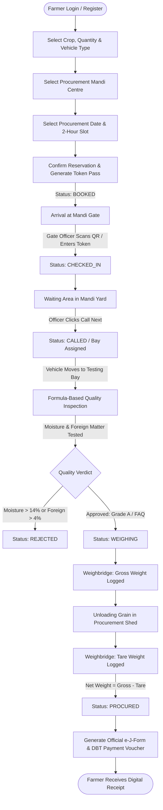

# 🌾 KisanSetu — Product Requirement Document (PRD)

> **Smart India Hackathon 2026 (SIH)**  
> **Problem Statement:** Smart Agricultural Procurement Slot & Queue Management Platform for Mandis  
> **Repository Baseline:** PostgreSQL + Express + React (Vite) + Socket.IO  

---

## 1. Problem Statement

Indian Agricultural Produce Market Committee (APMC) Mandis and FCI procurement centres experience severe operational bottlenecks during peak harvest seasons (Rabi & Kharif):
- **Highway Gridlocks & Turnaround Delays:** Farmers queue in tractor-trolleys and trucks on highways for 12–24+ hours due to uncoordinated, walk-in arrivals.
- **Physical Clashes & Queue Jumping:** Lack of transparent, verifiable queue sequencing results in chaotic gate arrivals and unfair priority disputes.
- **Manual & Opaque Quality Grading:** Subjective assessment of grain moisture and foreign matter content without automated standard calculation creates farmer distrust.
- **Weighbridge Bottlenecks & Tampering Risks:** Disconnected paper weight slips cause delays and data discrepancies between gross and tare weight logging.
- **Delayed Payout Visibility:** Farmers lack instant, transparent documentation (e-J-Form) and real-time status tracking for their Direct Benefit Transfer (DBT) bank payouts.

---

## 2. Proposed Solution

**KisanSetu** is an end-to-end digital agro-procurement slot reservation and real-time Mandi queue management platform. It transforms chaotic Mandi operations into a scheduled, transparent, and streamlined workflow:
1. **Dynamic 2-Hour Slot Reservation:** Farmers book time slots based on Mandi capacity, vehicle category, and real-time traffic heuristics.
2. **Cryptographic QR Gate Passes:** Farmers receive digital passes with unique token identifiers (`TK-KRL-xxx`) for rapid gate verification.
3. **Four-Stage Officer Kanban Workflow:** Digitizes the operational pipeline: *Scheduled Slots → Gate Check-in → Rule/Formula-Based Quality Assessment → Weighbridge → e-J-Form Procurement*.
4. **Real-time Synchronized Ecosystem:** WebSocket-powered dashboards update farmer tracking passes, officer control boards, and public Mandi TV displays with zero manual page refreshing.
5. **Multilingual Accessibility:** Multilingual UI support and voice-assisted query resolution in Indian regional languages (Hindi, Punjabi, Marathi, Telugu, English).

---

## 3. Target Users & Stakeholders

| User Role | Description | Primary Touchpoints |
| :--- | :--- | :--- |
| **Farmer (Annadata)** | Agricultural producer bringing harvested grain (Wheat, Paddy, Mustard, etc.) to the procurement centre. | Farmer Mobile/Web Portal (`/book-slot`, `/token/:id`, `/my-bookings`, Voice Modal) |
| **Mandi Supervisor / Officer** | Administrative officer overseeing centre throughput, gate admissions, and overall queue pacing. | Officer Command Center (`/centre/officer`), Public Display Controller |
| **Quality Inspector** | Agricultural lab technician inspecting grain samples for moisture, foreign matter, and shriveled grains. | Quality Inspection Modal (`POST /api/procurement/quality-check`) |
| **Weighbridge Operator** | Scale operator recording loaded gross weight and empty tare weight of vehicles. | Weighbridge Entry Modal (`POST /api/procurement/weighbridge`) |
| **Public / Farmers at Yard** | Drivers and farmers waiting in parking yards observing call sequences. | Gate Big Screen TV Display (`/display/:centreId`) |

---

## 4. Current MVP Features & Implementation Status

| Feature Area | Feature Description | Status | Current Implementation Details |
| :--- | :--- | :--- | :--- |
| **Authentication** | JWT-based auth with secure password hashing (bcrypt) | `IMPLEMENTED` | `/api/auth/login`, `/api/auth/register-farmer`, `/api/auth/me` |
| **Role Authorization** | Granular role isolation for `farmer`, `centre_officer`, `quality_inspector`, `weighbridge_operator`, `admin` | `IMPLEMENTED` | Route-level `ProtectedRoute.jsx` + backend `authorizeRoles()` middleware |
| **Demo Switcher** | 1-Click Quick Demo Profiles for presentation | `IMPLEMENTED` | Pre-seeded accounts in `AuthContext.jsx` and login page |
| **Slot Booking** | 3-Step booking (Crop/Vehicle → Mandi Selection → 2-Hour Slot Window) | `IMPLEMENTED` | `BookSlot.jsx`, dynamic date selector with 4-day rolling window |
| **Slot Timing Validation** | Prevention of booking expired time slots for Today | `IMPLEMENTED` | Client & server enforce `isSlotPassed()` based on current local time |
| **Digital Token Pass** | Verifiable digital pass with QR code, token number, and Mandi details | `IMPLEMENTED` | `TokenPass.jsx`, dynamic QR code generation, station indicator |
| **Officer Dashboard** | Multi-column operational Kanban board | `IMPLEMENTED` | `OfficerDashboard.jsx` (Scheduled, Waiting, Quality, Weighbridge, Procured) |
| **Gate Check-in** | Gate admission via QR code lookup or token ID | `IMPLEMENTED` | `POST /api/queue/:centreId/check-in` transitioning `BOOKED` → `CHECKED_IN` |
| **Call Next** | Audio-visual paging of waiting vehicles to specific bays | `IMPLEMENTED` | `POST /api/queue/:centreId/call-next`, emits Socket.IO event |
| **Formula-Based Quality Grading** | Rule/formula-based moisture, foreign matter, and deduction calculation | `IMPLEMENTED` | `POST /api/procurement/quality-check` (Grade A, FAQ, Rejected) |
| **Digital Weighbridge** | Gross weight, Tare weight, and Net weight calculation | `IMPLEMENTED` | `POST /api/procurement/weighbridge` with auto-procurement trigger |
| **Instant e-J-Form & Payout** | Digital procurement receipt and simulated DBT payment record | `IMPLEMENTED` | Auto-generated upon tare completion at official MSP base rates |
| **Live Gate TV Display** | Fullscreen display board for Mandi yards with status feeds | `IMPLEMENTED` | `PublicMandiDisplay.jsx` (`/display/:centreId`) |
| **Realtime Sync** | Multi-room WebSocket events across clients | `IMPLEMENTED` | `queueSocket.js` (`queue:update`, `token:called`) |
| **Mandi Analytics** | Real-time aggregate operational KPIs & commodity breakdown | `IMPLEMENTED` | `MandiAnalytics.jsx`, `/api/procurement/analytics` |
| **Multilingual Engine** | 5-Language UI localization (EN, HI, PB, MR, TE) | `IMPLEMENTED` | `LanguageContext.jsx` with full key-value translation dictionaries |
| **Heuristic Wait Predictor** | Heuristic-based wait-time estimation using queue density | `IMPLEMENTED` | `/api/ai/predict-wait-time/:bookingId` |
| **Heuristic Slot Recommender** | Heuristic traffic-balancing and Mandi load ranking | `IMPLEMENTED` | `/api/ai/recommend-slot` |
| **Voice & Query Helper** | Multilingual browser-based speech recognition & keyword matching | `IMPLEMENTED` | `AiVoiceModal.jsx` (Web Speech API + `/api/ai/chat-assistant` regex matching) |
| **Dedicated A4 PDF Export** | Clean `@media print` printable layout for tokens and J-Forms | `IN PROGRESS` | Basic `window.print()` exists; print-specific stylesheet optimization pending |
| **Gemini Contextual Advisory** | Gemini-powered contextual advisory for agronomy Q&A | `PLANNED` | Backend endpoints structured; API integration ready for Phase 2 |
| **OCR Weight Slip Scanner** | Camera-based automatic digit extraction from physical weight slips | `FUTURE` | Planned for post-hackathon hardware integration |
| **GPS Geofence Auto Check-in**| Automatic gate check-in when vehicle enters Mandi perimeter | `FUTURE` | Architectural roadmap item |

---

## 5. End-to-End MVP Workflow



---

## 6. Heuristics & Planned Intelligence Features

1. **Heuristic Traffic-Balanced Slot Recommender (`IMPLEMENTED - Heuristic Intelligence`):**
   - Ranks Mandis based on active yard queue count, daily capacity, and historical turnaround heuristics.
   - Tags optimal centres with `⭐ Best Match (Fastest Turnaround)`.
2. **Heuristic Queue Wait-Time Predictor (`IMPLEMENTED - Heuristic Intelligence`):**
   - Calculates estimated remaining wait times using vehicle-type multipliers (e.g., Tractor Trolley = 12 mins, Heavy Truck = 22 mins) and active vehicles ahead.
3. **Multilingual Voice & Query Assistant (`IMPLEMENTED - Heuristic Intent Matching + Web Speech`):**
   - Browser Web Speech API captures regional voice input.
   - Backend matches intent heuristics for MSP rates, token status, moisture thresholds, and booking navigation.
4. **Gemini-Powered Contextual Advisory (`PLANNED`):**
   - Integration of Gemini-powered contextual advisory for dynamic weather-aware procurement advisories and vernacular Q&A.

---

## 7. Novelty & Key Differentiators

| Capability | Traditional Mandi Operations | KisanSetu Platform |
| :--- | :--- | :--- |
| **Arrival Timing** | Unscheduled, 12–24h highway congestion | 2-hour dynamic slot booking (~38m yard turnaround) |
| **Gate Entry** | Physical paper slips, manual registers | Cryptographic digital QR token passes |
| **Queue Visibility** | Shouting, manual tracking, physical disputes | Real-time WebSocket Kanban & Public Gate TV screen |
| **Quality Grading** | Subjective, non-transparent assessment | Automated rule/formula: Moisture & Impurities → Auto Grade A/FAQ |
| **Weighment** | Handwritten slips prone to weight tampering | Digital Gross − Tare logging with direct database write |
| **Documentation** | Multi-day delay in receiving physical J-Form | Instant digital e-J-Form & DBT voucher generated on weighment |
| **Farmer Inclusivity**| Text-only English/Hindi portals | Voice-assisted multilingual interface (5 regional languages) |

---

## 8. Functional Requirements

### 8.1 Authentication & Authorization
- **FR-01:** Users can log in using a 10-digit mobile number and password.
- **FR-02:** New farmers can register by providing Full Name, Phone, State, District, Village, and optional Aadhaar/Bank details.
- **FR-03:** The platform must enforce strict role authorization:
  - Farmers cannot access `/centre/officer` or invoke officer APIs.
  - Officers cannot access farmer booking creation routes.
  - Unauthenticated requests to protected pages must redirect to `/login`.
- **FR-04:** Logout must terminate all local storage tokens and active sessions immediately.

### 8.2 Farmer Slot Reservation
- **FR-05:** Farmers can select from supported commodities: Wheat, Paddy (Basmati), Paddy (PR), Mustard, Gram, Maize, Soybean, Cotton, Turmeric.
- **FR-06:** System must enforce vehicle capacity constraints (Bullock Cart: ≤30 Qtl, Mini Truck: 30–70 Qtl, Tractor Trolley: 50–100 Qtl, Heavy Truck: 150–300 Qtl).
- **FR-07:** Slot booking must prevent selecting past 2-hour windows for Today based on actual current time.
- **FR-08:** Successful booking must generate a unique token (e.g., `TK-KRL-101`), QR hash, and persist to PostgreSQL within an atomic transaction.

### 8.3 Officer Operations & Queue Management
- **FR-09:** Officer dashboard must display real-time counts for Today's Bookings, Active Yard Queue, Completed Procurements, and Avg Turnaround.
- **FR-10:** Gate officers can check in vehicles via Token ID or QR hash.
- **FR-11:** Officers can trigger "Call Next" to broadcast vehicle bay assignments across sockets and TV screens.
- **FR-12:** Quality Inspectors can submit Moisture (%), Foreign Matter (%), and Damaged Grain (%) to compute automated rule-based grade and deduction.
- **FR-13:** Weighbridge operators can submit Gross and Tare weights in kg. System must compute Net Weight (Quintals) = `(Gross - Tare) / 100`.
- **FR-14:** On weighbridge completion, system must transition status to `PROCURED`, compute total payout (`Net Weight × Base MSP`), and generate payment reference `PAY-xxx`.

---

## 9. Non-Functional Requirements

- **NFR-01 (Performance):** Dashboard API responses under 150ms; WebSocket state synchronization under 100ms.
- **NFR-02 (Reliability & Fault Tolerance):** Dual-layer database architecture — primary PostgreSQL 18 with automatic fallback to synchronized in-memory mock store if database connectivity is unavailable.
- **NFR-03 (Security):** JWT tokens with 24-hour expiration; passwords encrypted using bcrypt (salt rounds: 8–10); SQL parameterized queries to prevent SQL injection.
- **NFR-04 (Usability):** Mobile-first responsive design; high-contrast interface for outdoor Mandi sunlight readability.
- **NFR-05 (Accessibility):** Full support for voice input and regional text localization in 5 Indian languages.

---

## 10. Technology Stack

```
├── Frontend Layer
│   ├── Framework: React 18 (Vite Bundler)
│   ├── Routing: React Router DOM v6
│   ├── State Management: React Context API (AuthContext, LanguageContext)
│   ├── Styling: TailwindCSS + Clean Government Service UI Design System
│   ├── Icons: Lucide React
│   ├── Realtime Client: Socket.IO Client
│   └── QR & Barcode: qrcode.react
│
├── Backend Layer
│   ├── Runtime: Node.js (ES Modules)
│   ├── Web Framework: Express.js
│   ├── Realtime Engine: Socket.IO Server (WebSockets)
│   ├── Security & Auth: JSON Web Tokens (jsonwebtoken), bcryptjs, cors
│   └── Validation: Custom middleware (auth.js, slots.js)
│
└── Database & Storage Layer
    ├── Primary RDBMS: PostgreSQL 18 (pg client pool)
    ├── Schema Management: Relational tables with foreign key constraints & indexes
    └── Fallback Store: In-memory JavaScript data store (zero-crash demo reliability)
```

---

## 11. Database & Backend Architecture

### 11.1 PostgreSQL Schema Architecture

```
┌─────────────────┐       ┌─────────────────┐       ┌─────────────────┐
│     users       │       │     centres     │       │      slots      │
├─────────────────┤       ├─────────────────┤       ├─────────────────┤
│ id (PK)         │       │ id (PK)         │◄──────│ centre_id (FK)  │
│ full_name       │       │ name            │       │ id (PK)         │
│ phone (UNIQUE)  │       │ code (UNIQUE)   │       │ slot_date       │
│ role            │       │ district, state │       │ start_time      │
│ password_hash   │       │ daily_capacity  │       │ end_time        │
└────────┬────────┘       └────────┬────────┘       │ max_tokens      │
         │                         │                └────────┬────────┘
         │                         │                         │
         │        ┌────────────────┴────────┐                │
         └───────►│        bookings         │◄───────────────┘
                  ├─────────────────────────┤
                  │ id (PK)                 │
                  │ token_number (UNIQUE)   │
                  │ farmer_id (FK)          │
                  │ centre_id (FK)          │
                  │ slot_id (FK)            │
                  │ crop_name, quantity     │
                  │ vehicle_number, type    │
                  │ status (ENUM)           │
                  │ qr_code_hash            │
                  └───────────┬─────────────┘
                              │
         ┌────────────────────┼────────────────────┐
         ▼                    ▼                    ▼
┌──────────────────┐ ┌──────────────────┐ ┌──────────────────┐
│  quality_checks  │ │ weighbridge_logs │ │     payments     │
├──────────────────┤ ├──────────────────┤ ├──────────────────┤
│ id (PK)          │ │ id (PK)          │ │ id (PK)          │
│ booking_id (FK)  │ │ booking_id (FK)  │ │ booking_id (FK)  │
│ moisture_pct     │ │ gross_weight_kg  │ │ total_amount     │
│ foreign_matter   │ │ tare_weight_kg   │ │ rate_per_quintal │
│ grain_grade      │ │ net_weight_qtl   │ │ status, dbt_ref  │
└──────────────────┘ └──────────────────┘ └──────────────────┘
```

### 11.2 Status State Machine
$$\text{BOOKED} \longrightarrow \text{CHECKED\_IN} \longrightarrow \text{CALLED} \longrightarrow \text{QUALITY\_INSPECTION} \longrightarrow \text{WEIGHING} \longrightarrow \text{PROCURED}$$
*(Alternative terminal state: $\text{REJECTED}$ if moisture/impurity limits are exceeded).*

---

## 12. Realtime / Socket.IO Architecture

- **Mandi-Specific Rooms:** Clients connect and join room `centre:<centreId>` (e.g., `centre:ctr_karnal_01`).
- **Broadcast Events:**
  - `queue:update` — Dispatched on every status change, check-in, or new booking; prompts connected officer dashboards, farmer passes, and TV screens to refresh.
  - `token:called` — Dispatched when an officer pages a token to a specific desk or bay; triggers browser audio chime and visual alert.

---

## 13. UI / UX Design Principles

- **Clean & High-Contrast Design System:** Clean, professional agricultural/government-service interface with restrained cards, consistent spacing, accessible typography, high outdoor readability, and purposeful micro-animations. Deep slate palette with emerald/kisan accents providing contrast in outdoor and high-glare environments.
- **Micro-Animations & Visual Cues:** Ping indicators for live statuses, color-coded stage badges (Yellow = Checked-In, Amber = Called, Blue = Quality, Indigo = Weighing, Emerald = Procured).
- **Zero Confusion Presentation:** Dedicated 1-Click Role Switcher dropdown and pre-filled demo accounts for rapid SIH judges walkthroughs.

---

## 14. Security Requirements

- **JWT Authentication:** Strict authorization bearer tokens on all sensitive mutation endpoints.
- **Backend Role Guarding:** Officer actions (`/check-in`, `/call-next`, `/quality-check`, `/weighbridge`) strictly reject requests from `farmer` accounts with HTTP 403 Forbidden.
- **SQL Sanitization:** Parameterized SQL queries across all PostgreSQL transactions.
- **Client Route Protection:** Client-side React Router redirects unauthenticated users and restricts cross-role page access.

---

## 15. Future Scope & Roadmap

1. **Gemini-Powered Contextual Advisory:** Voice-driven conversational booking in vernacular dialects.
2. **Automated Optical Slip Extraction (OCR):** Camera integration to scan paper weighbridge slips directly into the web form.
3. **SMS & WhatsApp Token Updates:** Integration of Twilio / Gupshup API for SMS token passes for non-smartphone farmers.
4. **GPS-Based Gate Geofencing:** Auto-check-in when the farmer's tractor enters within 500m of the Mandi gate.

---

## 16. MVP Acceptance Criteria (SIH Demo Checklist)

| # | Acceptance Criterion | Test Verification Method | Result |
| :- | :--- | :--- | :--- |
| **AC-01** | Past 2-hour slots for Today are disabled; future slots remain bookable | Playwright automated browser test | `PASS` |
| **AC-02** | Unauthenticated users cannot access `/book-slot`, `/my-bookings`, or `/centre/officer` | Automated redirect to `/login` | `PASS` |
| **AC-03** | Farmer account cannot open Officer Dashboard (`/centre/officer`) | Auto-redirected to `/my-bookings` | `PASS` |
| **AC-04** | Farmer JWT token cannot invoke backend officer mutation APIs | HTTP 403 Forbidden returned | `PASS` |
| **AC-05** | New farmer booking appears in real-time on the Officer Dashboard | Verified live via PostgreSQL & Socket.IO | `PASS` |
| **AC-06** | Gate check-in transitions booking from `BOOKED` to `CHECKED_IN` | Verified in Officer Kanban board | `PASS` |
| **AC-07** | Officer Quality Lab transition (`CALLED` → `QUALITY_INSPECTION`) and formula grading | Verified in Quality modal & DB (`CALLED` → `QUALITY_INSPECTION` transition fix pending) | `IN PROGRESS` |
| **AC-08** | Gross minus Tare weighment calculates net weight and generates e-J-Form | Verified in Weighbridge modal & DB | `PASS` |
| **AC-09** | Public Gate TV screen reflects live queue and displays called token announcements | Verified on `/display/:centreId` | `PASS` |
| **AC-10** | Application builds cleanly with 0 compilation or linting errors | `npm run build` with Vite | `PASS` |
| **AC-11** | Dedicated A4 print layout for tokens and e-J-Forms without browser UI clutter | `@media print` stylesheet verification | `IN PROGRESS` |
